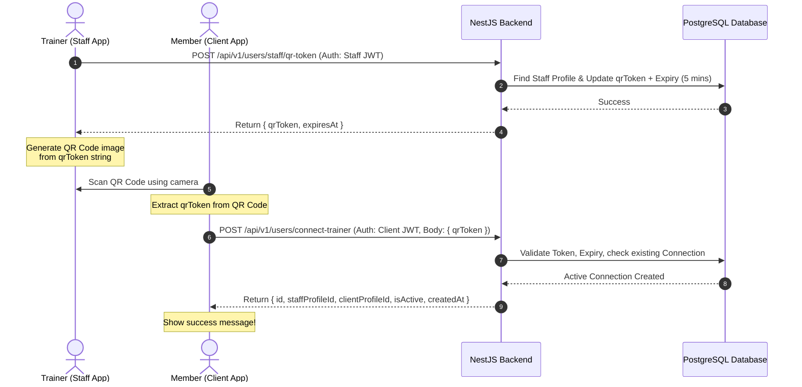

# QR-Based Staff-Client Connection API & Integration Guide

This document outlines the API endpoints, data structures, flow, and Flutter client-side integration guidelines for establishing a connection between a gym Staff Member (Trainer) and a Client (Member) using a temporary, secure QR Code.

---

## 1. Sequence Flow Diagram



---

## 2. API Endpoints

### 1. Generate QR Token (Staff Side)
Generates a unique, short-lived token (valid for 5 minutes) associated with the authenticated staff member's profile.

- **URL**: `/api/v1/users/staff/qr-token`
- **Method**: `POST`
- **Headers**:
  - `Content-Type: application/json`
  - `Authorization: Bearer <STAFF_JWT_TOKEN>`
- **Request Body**: None
- **Success Response**:
  - **Status Code**: `200 OK`
  - **Content-Type**: `application/json`
  - **Response Payload**:
    ```json
    {
      "qrToken": "550e8400-e29b-41d4-a716-446655440000",
      "expiresAt": "2026-06-20T12:35:00.000Z"
    }
    ```

- **Error Responses**:
  - **Status Code**: `401 Unauthorized` (Missing or invalid JWT token)
  - **Status Code**: `403 Forbidden` (User does not have the `staff`, `owner`, or `admin` role)
  - **Status Code**: `404 Not Found` (Staff user does not have a profile set up in the system)

---

### 2. Connect to Trainer (Client Side)
Establishes a connection between the scanning client profile and the trainer's profile using the scanned QR token.

- **URL**: `/api/v1/users/connect-trainer`
- **Method**: `POST`
- **Headers**:
  - `Content-Type: application/json`
  - `Authorization: Bearer <CLIENT_JWT_TOKEN>`
- **Request Body**:
  ```json
  {
    "qrToken": "550e8400-e29b-41d4-a716-446655440000"
  }
  ```

- **Success Response**:
  - **Status Code**: `200 OK`
  - **Content-Type**: `application/json`
  - **Response Payload**:
    ```json
    {
      "id": "connection-uuid-here",
      "staffProfileId": "staff-profile-uuid-here",
      "clientProfileId": "client-profile-uuid-here",
      "isActive": true,
      "createdAt": "2026-06-20T12:31:00.000Z"
    }
    ```

- **Error Responses**:
  - **Status Code**: `400 Bad Request`:
    - If the QR token is invalid, expired, or doesn't belong to any trainer.
    - If the client is already connected to this trainer.
  - **Status Code**: `401 Unauthorized` (Missing or invalid client JWT token)
  - **Status Code**: `404 Not Found` (Client profile not found on the database)

---

## 3. Flutter Integration Guidelines

### A. Staff App (Generating & Displaying the QR Code)

1. **Dependency Setup**:
   Add [qr_flutter](https://pub.dev/packages/qr_flutter) to your pubspec:
   ```yaml
   dependencies:
     qr_flutter: ^4.1.0
   ```

2. **Fetching and Displaying**:
   - Send the authorized request to `/api/v1/users/staff/qr-token`.
   - Store the response `qrToken` and `expiresAt` in state.
   - Present the token using the `QrImageView` widget:
     ```dart
     import 'package:qr_flutter/qr_flutter.dart';

     QrImageView(
       data: qrToken, // The string received from backend
       version: QrVersions.auto,
       size: 250.0,
       gapless: false,
       embeddedImage: AssetImage('assets/images/gym_logo.png'), // Optional branding
       embeddedImageStyle: QrEmbeddedImageStyle(
         size: Size(40, 40),
       ),
     )
     ```

3. **Lifecycle & Expiry Handlers**:
   - Start a countdown timer based on `expiresAt`.
   - Once the timer expires, automatically show a **"Refresh QR Code"** button or trigger a new API call to generate a fresh token.

---

### B. Client App (Scanning & Connecting)

1. **Dependency Setup**:
   Add [mobile_scanner](https://pub.dev/packages/mobile_scanner) (or similar) to your pubspec:
   ```yaml
   dependencies:
     mobile_scanner: ^5.0.0
   ```

2. **Scanner Implementation**:
   Implement a camera scanner view that listens for a barcode:
   ```dart
   import 'package:mobile_scanner/mobile_scanner.dart';

   class QrScannerScreen extends StatefulWidget {
     @override
     _QrScannerScreenState createState() => _QrScannerScreenState();
   }

   class _QrScannerScreenState extends State<QrScannerScreen> {
     bool _isConnecting = false;

     @override
     Widget build(BuildContext buildContext) {
       return Scaffold(
         appBar: AppBar(title: Text('Scan Trainer QR')),
         body: Stack(
           children: [
             MobileScanner(
               onDetect: (capture) {
                 final List<Barcode> barcodes = capture.barcodes;
                 if (barcodes.isNotEmpty && !_isConnecting) {
                   final String? rawValue = barcodes.first.rawValue;
                   if (rawValue != null) {
                     _connectToTrainer(rawValue);
                   }
                 }
               },
             ),
             if (_isConnecting)
               Center(child: CircularProgressIndicator()),
           ],
         ),
       );
     }

     Future<void> _connectToTrainer(String token) async {
       setState(() => _isConnecting = true);

       // Call POST /api/v1/users/connect-trainer with body: {"qrToken": token}
       final success = await ApiService.connectToTrainer(token);

       setState(() => _isConnecting = false);

       if (success) {
         ScaffoldMessenger.of(context).showSnackBar(
           SnackBar(content: Text('Connected to Trainer Successfully!')),
         );
         Navigator.pop(context);
       } else {
         ScaffoldMessenger.of(context).showSnackBar(
           SnackBar(content: Text('Failed to connect. The QR might be expired.')),
         );
       }
     }
   }
   ```
